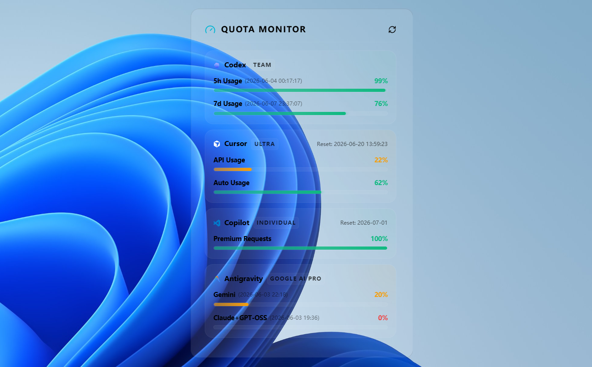
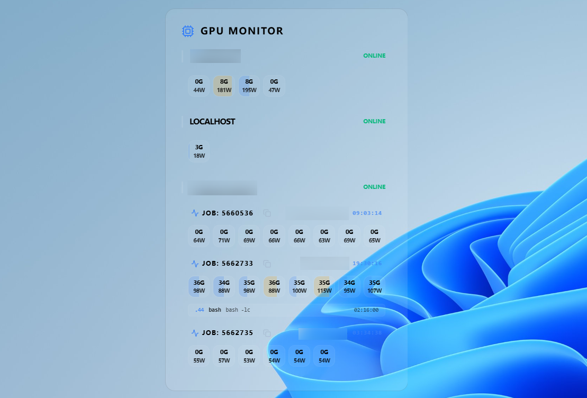

<p align="center">
  
</p>

<h1 align="center">Widgitron</h1>

<p align="center">
  <strong>A high-performance, modular desktop widget framework for researchers and developers.</strong>
</p>

<p align="center">
  <a href="https://github.com/starkmomo/widgitron/releases">
    
  </a>
  <a href="https://www.rust-lang.org/">
    
  </a>
  <a href="https://tauri.app/">
    
  </a>
  <a href="https://react.dev/">
    
  </a>
  <a href="LICENSE">
    
  </a>
</p>

> [!TIP]
> Windows users can download the pre-compiled standalone executable directly from the [Releases](https://github.com/starkmomo/widgitron/releases) page.

Widgitron is a modern, cross-platform dashboard built with **Tauri**, **Rust**, and **React**. It provides a premium, glassmorphic UI for monitoring GPUs, conference deadlines, and arxiv research papers.

<p align="center">
  
  
</p>
<p align="center">
  
  
</p>

## 🗺️ Roadmap

### ✅ Completed
- [x] Tauri 2.0 & Rust backend migration
- [x] Modern React-based Glassmorphism UI
- [x] GPU monitoring (Persistent SSH)
- [x] Slurm integration & Job ID tracking
- [x] Paper deadline countdown widget
- [x] Advanced widget theme customization
- [x] Arxiv Radar: paper card with swipe gestures
- [x] Agent quota monitor widget (Codex, Cursor, etc.)


## 🚀 Quick Start

### Installation

```bash
# Clone the repository
git clone https://github.com/starkmomo/widgitron.git
cd widgitron

# Install dependencies
pnpm install
```

### Run

```bash
# Development mode
pnpm tauri dev

# Build production executable
pnpm tauri build
```

## 🤝 Contributing

Contributions welcome! Here's how:

1. Fork the repository
2. Create a feature branch (`git checkout -b feature/amazing-widget`)
3. Commit your changes (`git commit -m 'Add amazing widget'`)
4. Push to the branch (`git push origin feature/amazing-widget`)
5. Open a Pull Request

## 📄 License

MIT License - see [LICENSE](LICENSE) file for details.
