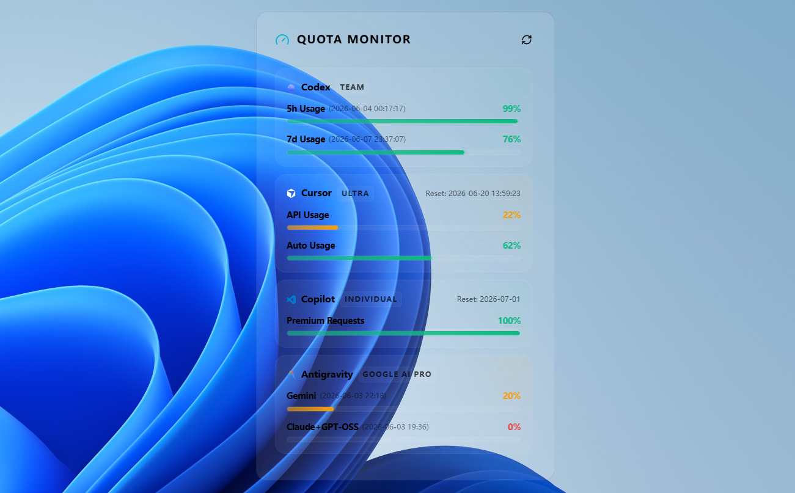
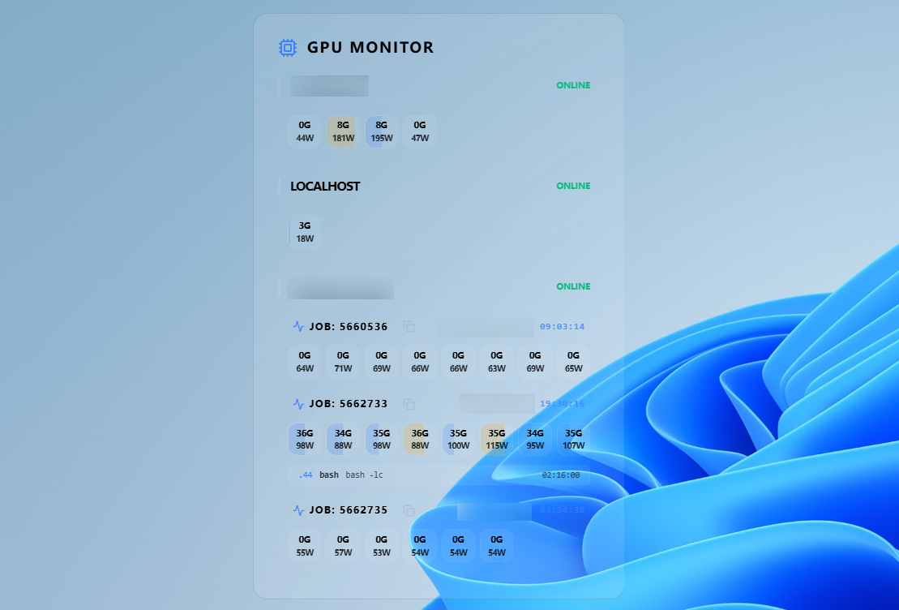

<p align="center">
  
</p>

<h1 align="center">Widgitron</h1>

<p align="center">
  <a href="README.md">English</a> ｜ <strong>中文版</strong>
</p>

<p align="center">
  <strong>面向研究人员与开发者的高性能模块化桌面小组件框架。</strong>
</p>

<p align="center">
  <a href="https://github.com/starkmomo/widgitron/releases">
    
  </a>
  <a href="https://www.rust-lang.org/">
    
  </a>
  <a href="https://tauri.app/">
    
  </a>
  <a href="https://react.dev/">
    
  </a>
  <a href="LICENSE">
    
  </a>
</p>

> [!TIP]
> Windows 用户可直接从 [Releases](https://github.com/starkmomo/widgitron/releases) 下载已编译的独立程序。

Widgitron 是基于 **Tauri**、**Rust** 和 **React** 的跨平台桌面仪表板，提供玻璃拟态界面，用于监控 GPU、论文截止日期和 arXiv 论文。

<p align="center">
  
  
</p>
<p align="center">
  
  
</p>

## 🗺️ 开发路线

### ✅ 已完成
- [x] GPU 监控（持久化 SSH 连接）
- [x] Slurm 集成与任务 ID 跟踪
- [x] 论文截止日期倒计时小组件
- [x] 高级小组件主题自定义
- [x] arXiv 雷达：支持滑动手势的论文卡片
- [x] Agent 额度监控小组件（Codex、Cursor 等）
- [x] 可停靠的侧边栏


## 🚀 快速开始

### 安装

```bash
# 克隆仓库
git clone https://github.com/starkmomo/widgitron.git
cd widgitron

# 安装依赖
pnpm install
```

### 运行

```bash
# 开发模式
pnpm tauri dev

# 构建正式版
pnpm tauri build
```

### macOS 构建

需要 Xcode、Node.js 和 pnpm。

```bash
pnpm macos:build
```

应用及原生额度、GPU、截止日期小组件会构建到 `src-tauri/target/release/bundle/macos/`。
可在通知中心的“编辑小组件”中添加。构建时优先使用 Apple Development 证书，否则使用临时签名。

### 自动构建

GitHub Actions 会在推送和拉取请求时构建 Windows 安装包及包含 WidgetKit 小组件的 macOS 应用。
产物可在构建完成后的七天内下载；CI 无需 Apple 凭证。macOS 产物尚未公证，首次尝试打开后，
可能需要到“**系统设置 → 隐私与安全 → 仍要打开**”确认
（参见 [Apple 说明](https://support.apple.com/en-us/102445)）。若希望分发时无需这一步，
需使用 Developer ID 签名并完成公证。

## 🤝 参与贡献

欢迎贡献代码：

1. Fork 本仓库
2. 创建功能分支（`git checkout -b feature/amazing-widget`）
3. 提交改动（`git commit -m 'Add amazing widget'`）
4. 推送分支（`git push origin feature/amazing-widget`）
5. 创建 Pull Request

## 📄 许可证

本项目采用 MIT 许可证，详情见 [LICENSE](LICENSE)。
